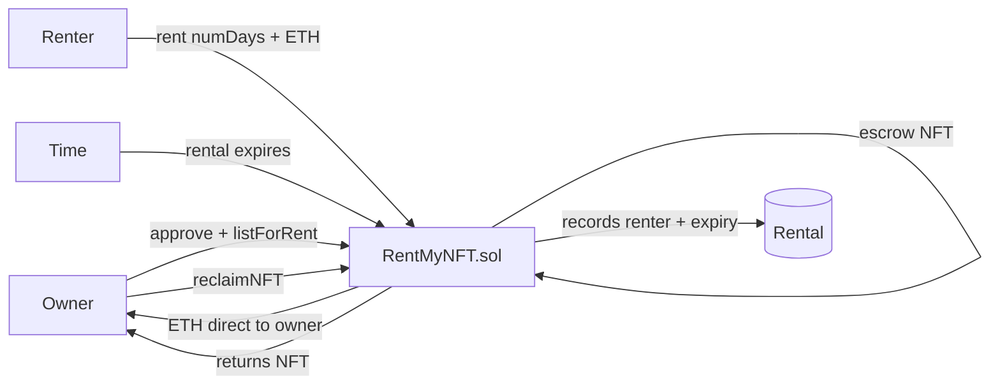

# RentMyNFT — Peer-to-peer NFT rental marketplace with time-locked escrow

> List your NFT for rent at a daily price. Renters pay for exact days. The contract holds the NFT in escrow and returns it automatically after expiry.


🔗 **Live demo:** _coming soon_
📜 **Contract (Sepolia):** _deploy pending_

---

## What it does

- NFT owners **list their NFT for rent** with a price per day and a max rental duration.
- The contract **holds the NFT in escrow** — the owner can't rug the renter mid-rental.
- Renters **choose how many days** they want and pay the exact ETH cost.
- The rent payment goes **directly to the owner** at the moment of rental.
- After the rental period expires, the owner **reclaims their NFT**.
- Owners can **cancel listings** at any time (unless a rental is active).

## How it works



## Tech stack

| Layer | Tech |
|-------|------|
| Smart contract | Solidity 0.8.24 |
| Standards | OpenZeppelin IERC721, ReentrancyGuard |
| Dev / testing | Foundry (forge, anvil) + fuzz testing |
| Frontend | Next.js + wagmi + viem + RainbowKit |
| Network | Ethereum Sepolia testnet |

## Key design decisions

**NFT held in escrow by the contract**
When an owner lists their NFT, it transfers to the contract. This prevents the owner from selling or transferring the NFT while it's rented — the renter has a guaranteed usage window.

**Payment goes directly to the owner at rent time**
ETH is not held by the contract. It flows directly to the owner when `rent()` is called. This removes the need for withdrawal patterns and reduces the contract's attack surface (no ETH balance to target).

**`_isActiveRental` view for time-based logic**
The active/expired check is centralised in one internal function: `renter != address(0) && block.timestamp < rentedUntil`. This prevents the same logic from diverging across `rent`, `reclaimNFT`, and `cancelListing`.

**CEI pattern in `rent`**
State (renter + expiry) is updated before the ETH transfer to the owner. A malicious owner contract cannot re-enter `rent` to get paid twice.

**`days` is a Solidity reserved keyword**
Parameters were named `numDays` instead — `days` is a built-in time unit in Solidity (`1 days == 86400`), so using it as a parameter name causes a compile error.

## Testing ⭐

```bash
forge test -vvv
```

25 tests covering:
- ✅ Listing transfers NFT to escrow and stores data
- ✅ Reverts: not NFT owner, zero price, zero max days
- ✅ Rent records renter and correct expiry timestamp
- ✅ Rent pays owner directly
- ✅ Reverts: not listed, already rented, exceeds max days, wrong payment, zero days
- ✅ `isRented` returns true during active, false after expiry
- ✅ Reclaim returns NFT after expiry, clears listing
- ✅ Reverts reclaim: not owner, rental still active
- ✅ Cancel returns NFT if never rented
- ✅ Cancel after expiry works (treated same as reclaim)
- ✅ **Fuzz:** 1000 random day counts within max — exact payment always succeeds

## Run locally

```bash
forge build
forge test -vvv

cp .env.example .env
# fill in SEPOLIA_RPC_URL and PRIVATE_KEY
source .env && forge script script/Deploy.s.sol \
  --rpc-url $SEPOLIA_RPC_URL --private-key $PRIVATE_KEY --broadcast
```

## What I learned

Escrow-based contracts shift trust from counterparties to code. The hardest design question was: who holds the payment? Holding ETH in the contract (and using a withdrawal pattern) protects against failed ETH sends — but direct payment reduces the contract's attack surface. Here I chose direct payment since the owner's address is set at listing time. Also: `days` being a reserved Solidity keyword is a gotcha that only shows up at compile time — good reminder to check the [reserved words list](https://docs.soliditylang.org/en/latest/cheatsheet.html#reserved-keywords).

---

## Contact

**Armando Ochoa** · Smart Contract Developer
📧 armaochoa99@gmail.com · Open to Web3 opportunities.

> Built as part of my blockchain developer journey.
